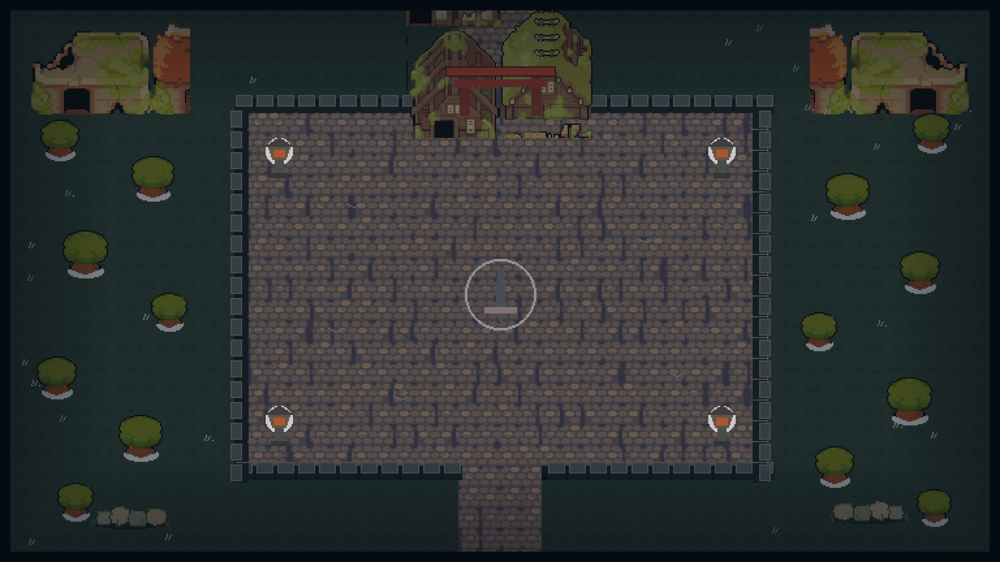

# 黑剑·荒寺夜行

一款使用 Godot 4 制作的 2D 俯视角武侠肉鸽试玩版。玩家持黑剑夜闯荒寺，在不断增强的妖物围攻中修炼招式与心法，最终迎战 Boss「鬼面剑豪」。



## 当前内容

- 一张可探索的夜间荒寺地图，包含薄雾、月光和树干实体碰撞。
- 一名使用自定义角色图集的玩家角色，具备移动、攻击、受击和死亡表现。
- 四类普通敌人：尸傀、影犬、灯笼鬼、重甲怨卒。
- 四波逐步增强的敌群，后期同类敌人的生命值会明显上升。
- Boss「鬼面剑豪」，包含近战斩击、冲锋、弹幕、环形剑阵和召唤小怪。
- 八个主动招式、两个被动心法，全部可升至 5 级。
- 标题、HUD、暂停、升级三选一、胜负结算和重新开始流程。
- Master、Music、SFX 三条音频总线。

## 操作

| 操作 | 按键 |
| --- | --- |
| 移动 | `WASD` 或方向键 |
| 暂停 / 继续 | `Esc` |
| 选择升级 | 鼠标点击或数字键 `1`、`2`、`3` |
| 攻击 | 自动索敌并释放 |

升级界面出现时战斗会完全暂停。每局最多持有 4 个主动招式和 2 个被动心法。

## 技能

主动招式：

- 黑剑·横扫
- 飞剑诀
- 剑气纵横
- 回风护体
- 落雷符
- 寒霜剑阵
- 烈阳掌
- 万剑归宗

被动心法：

- 轻身诀
- 淬锋心法

其中飞剑与剑气在升级后可获得障碍反弹能力；回风护体会随等级提高龙卷伤害、数量和旋转速度。

## 运行项目

推荐使用 **Godot 4.7 stable**。

1. 使用 Godot Project Manager 导入根目录下的 `project.godot`。
2. 打开项目后按 `F6` 可单独预览当前场景，按 `F5` 从标题页启动完整游戏。
3. 首次打开时等待 Godot 完成资源导入。

也可以从命令行启动：

```bash
godot --path .
```

macOS 默认安装位置下可使用：

```bash
/Applications/Godot.app/Contents/MacOS/Godot --path .
```

## 主要场景预设

项目中的角色与地图均为可独立打开、调整和复用的 `PackedScene`：

| 场景 | 职责 |
| --- | --- |
| `scenes/main.tscn` | 游戏入口，管理标题、HUD、暂停、升级和结算 |
| `scenes/gameplay/battle_arena.tscn` | 完整战斗场景，组装地图、玩家和各运行时对象层 |
| `scenes/world/abandoned_temple_map.tscn` | 荒寺地图、树干碰撞、雾气与月光 |
| `scenes/actors/player.tscn` | 玩家角色、视觉、身体碰撞和跟随摄像机 |
| `scenes/actors/enemies/corpse.tscn` | 尸傀预设 |
| `scenes/actors/enemies/hound.tscn` | 影犬预设 |
| `scenes/actors/enemies/lantern.tscn` | 灯笼鬼预设 |
| `scenes/actors/enemies/revenant.tscn` | 重甲怨卒预设 |
| `scenes/actors/boss.tscn` | 鬼面剑豪 Boss 预设 |

若要调整完整战斗布局，优先打开 `scenes/gameplay/battle_arena.tscn`；若只调整某个角色的贴图、缩放或碰撞范围，直接打开对应角色预设。

## 项目结构

```text
black-sword/
├── assets/                 # 角色、场景、特效、音频与字体
├── scenes/
│   ├── actors/             # 玩家、普通敌人和 Boss 预设
│   ├── gameplay/           # 组装后的战斗场景
│   ├── world/              # 地图预设
│   └── main.tscn           # 游戏入口
├── scripts/
│   ├── data/               # DamageEvent 与各类 Definition 数据接口
│   ├── arena.gd            # 波次、生成、经验和本局流程
│   ├── skill_system.gd     # 技能槽、升级、冷却与自动施放
│   └── *_actor.gd          # 玩家、敌人和 Boss 行为
├── tests/test_runner.gd    # Headless 自动验证
├── project.godot
└── CREDITS.md
```

## 自动验证

运行资源导入与脚本解析检查：

```bash
godot --headless --path . --editor --quit
```

运行完整自动测试：

```bash
godot --headless --path . --script tests/test_runner.gd
```

测试覆盖角色与地图预设结构、技能数量和等级上限、槽位过滤、升级暂停、碰撞与反弹、后期敌人血量、Boss 唯一生成及胜利结算。

## 开发说明

- 战斗数据集中在 `scripts/content_registry.gd`，新增或平衡技能、敌人与波次时优先从这里修改。
- 角色节点统一按职责命名，例如 `CharacterVisual`、`CharacterSprite`、`BodyCollision` 和 `FollowCamera`。
- 普通敌人与 Boss 通过对应 `PackedScene` 实例化，不再由脚本临时创建角色节点。
- 墙体只保留视觉，不设置空气墙；当前仅树干参与世界碰撞。
- `assets/actors/hero/hero_actual.png` 是当前玩家图集；旧武士素材 `samurai_blue.png` 仍保留，便于后续制作其他角色。
- 首版玩法面向桌面键盘与鼠标。项目包含导出预设，但暂未适配触屏操作、联网、存档或局外成长。

## 素材与许可

第三方素材及字体信息见 [CREDITS.md](CREDITS.md)。Noto Sans SC 的 OFL 许可证保存在 `licenses/OFL-1.1.txt`。

当前仓库未单独声明项目源代码许可证；如需公开发布或允许二次分发，请先补充明确的项目许可证。
